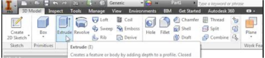
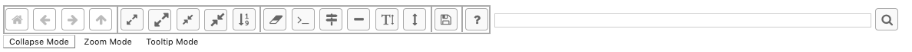

POEM ID: 006  
Title: Re-work the user experience in the N2 diagram  
Authors: hschilling (Herb Schilling)  
Competing POEMs: [N/A]  
Related POEMs: [N/A]  
Associated implementation PR:

Status:

- [ ] Active
- [ ] Requesting decision
- [ ] Accepted
- [ ] Rejected
- [x] Integrated

Motivation
==========
The primary motivations for this POEM are:

* The N2 user interface currently is limited in the number of operations that can be applied to the items in the 
hierarchy on the left. Only two
operations can be done via left and right click. These let the user do zooming and collapsing, respectively. Users 
should be able to perform additional operations on a system, such as getting metadata. The UI controls must be 
enhanced to allow that.
* The current toolbar does not make it obvious what capabilities exist. This is due to icons that don't reflect the
function and also the grouping of buttons is less than ideal.
* Screen real estate is an issue. Ideally the user could see the GUI controls (e.g. the toolbar and search box), 
the N2 diagram,
and the legend all without scrolling. That is currently not possible for even medium-sized models.
* Additional N2 features need to be considered for the future UI. For example, there was some talk about
 merging the connection viewer with N2, and/or providing more info about connections, like units.
* For very large models, it is difficult to zoom into a sub tree of the hierarchy and still have the context of where
you are in the overall model.

Description
===========

This POEM proposes the following changes:

* Add to the toolbar a way to choose modes for left-click and double-click. Applications like Photoshop use 
to interact with items in the app. This could be done using buttons and/or keyboard shortcuts. Mode changes
should be indicated by changes in the pointer icon. 
See [Modes in User Interfaces: When They Help and When They Hurt Users][1].
* Enable a contextual menu using right-click to let the user select additional operations
on hierachy items such as displaying metadata about the system
* Explore different options for the layout of the major elements of the diagram: N2 diagram, toolbar, search box 
and legend. 
Options include:
    * Put the toolbar on the left
    * Have the toolbar frozen on the top so when the user scrolls on the page, the toolbar is always present
* Improve the usability and usefullness of the toolbar. Research and draw inspiration from existing applications 
with toolbars such as Microsoft Office apps and Photoshop. Redesign many of the icons in the toolbar. Possibly 
include both an icon and text in the button.

* Use [card sorting][2] with team members and key users to determine how to group buttons in the toolbar.
* Implement tabs in the UI. This would enable having two tabs for the N2 diagram and the connections
viewer, unifying those two tools into one. 
* To deal with the issue of large models and losing context when zooming into sub hierarchies, consider implementing
[multi-scale scalable insets][3]. Scalable Insets is a new technique for interactively 
exploring and navigating large numbers of annotated patterns or features in multiscale visualizations.

Prototypes and Mockups
----------------------
A [prototype](POEM_006/n2_prototype_from_workshop.html) was created for the OpenMDAO Workshop that showed having buttons
to change modes and also having a right-click contextual menu. The prototype shows 3 different Modes: 
collapse mode, zoom mode, tooltip mode. 

Right-click offered the user the option to Collapse, and Edit File, as examples.

Additional mockups being worked on.

References
----------
1. Some ideas taken from presentation by 2019 summer intern UX designer, Sophia Hamed-Ramos
2. [Modes in User Interfaces: When They Help and When They Hurt Users](https://www.nngroup.com/articles/modes/)
3. [UI Garage](https://uigarage.net/)
4. [UI Patterns](http://ui-patterns.com/)
5. [User Interface Design in Modern Web Applications](https://www.smashingmagazine.com/user-interface-design-in-modern-web-applications/) see the section on hover controls

 [1]: https://www.nngroup.com/articles/modes/ "Modes in User Interfaces: When They Help and When They Hurt Users"
 [2]: https://www.usability.gov/how-to-and-tools/methods/card-sorting.html "Card Sorting"
 [3]: http://scalable-insets.lekschas.de/ "Scalable Insets"

