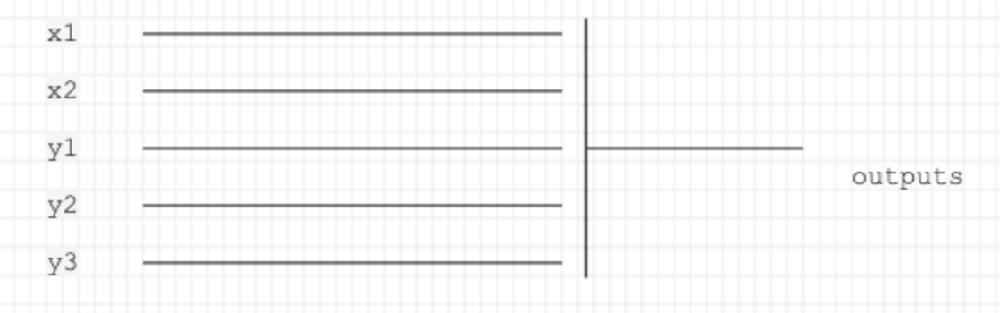
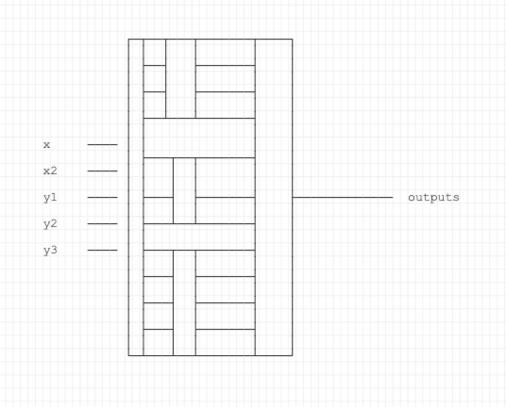

POEM ID: 064  
Title: Simple Caching for Matrix-Free Derivative APIs  
authors: Justin Gray (jsgray), Kevin Jacobson (kejacobson)  
Competing POEMs: N/A  
Related POEMs: N/A  
Associated implementation PR:  

Status:

- [ ] Active
- [ ] Requesting decision
- [ ] Accepted
- [x] Rejected
- [ ] Integrated

Rejected because an alternative solution was implemented without an API change via [#2534](#https://github.com/OpenMDAO/OpenMDAO/pull/2534)

## Motivation

This is a new proposed API allowing users to define if they want to use variable relevance reduction in their component linear operators or not.
The existing behavior is to always use that variable relevance reduction, but there are cases where this results in unnecessary extra calls to the linear operator method and hence higher derivative cost.

The new API would allow users control over this behavior and enable to them to get more efficient derivatives in certain cases.

### The common funnel compute case

OpenMDAO's API for matrix-free linear operators inherently assumes that component authors would want to be as stingy as possible about computing matrix-vector products.
If specific variables were not needed (i.e. not relevant), then it would be more efficient to skip the parts of the product associated with them. This is generally a good assumption if the structure of the computation has a lot of inputs and funnels directly down to a small number of outputs.

In the above example, if only y is relevant then you would only want to do the part of the product associated with y but not x.
The critical assumption is that the component can compute the product associated with y completely independently of that associated with x, i.e., there is no duplicate computation between the two products.
Because of [details of OpenMDAO's Linear Block Gauss-Siedel solver](https://youtu.be/4JQ1fMZbR1E?t=724),
it is very common that a component is asked for two separate matrix vector products with different variables relevant.
If you imagine an implicit component with a large state vector, and a large input vector ---such as a CFD solver with an input set of surface mesh coordinates that are changing.
The first one uses just the inputs to compute the right hand side for a linear solve.
The second one uses just the state vector to actually do the linear solve.
For cases the component has an internal iterative linear solver (e.g. GMres), then you can expect that the second type of call, with just the state variables, would be called a lot more often.
In this case, the solver and associated component wrapper likely would benefit from having two distinct specialized methods for each of those types of calls, to keep both of them as cheap as possible.

So, to facilitate this efficiency OpenMDAO very specifically only passes in the relevant variables to the `d_inputs`, `d_residuals`, and `d_outputs` linear vectors when it makes calls to the component linear operator.
The presence or absence of the variables in those vectors is what gives a component author the relevance information they need to decide which of the specialized linear operator methods to call.

### The (new) collapsed compute case

Sometimes the structure of the calculations in the compute method of a single component takes more of a sequence of computations.
This structure resembles an traditional RunOnce OpenMDAO Group more closely than a component.
However, a component author might collapse what would otherwise be a group down into a single component specifically to hide the intermediate variables from OpenMDAO to reduce the amount of data stored in memory.
One reason to do this could be the collapsed component doing a time domain analysis and looping over 1000s of time steps with each time step having a large state vector.
Internally the component can recompute, use file I/O, or checkpointing to get these intermediate states when needed for the linearizations.
Another case is solving a diamond shaped pattern where the computation is a set of related but independent computations with two or more steps that converge down to a small set of outputs, e.g., linearized aerodynamics where we are interested in solving for the fourier coefficients of the surface loads for a set of input frequencies which requires solving for the linearized flow state for each input frequency before computing the linearized loads in the second step.
As with the time-domain analysis, if OpenMDAO stored all the intermediate linearized flow states, the problem would not fit in memory.
By solving them as a loop within the component, the component can shuffle the linearized flow state between memory and files as needed for the linearizations.

For the funnel compute structure, in reverse mode there were savings by skipping the irrelevant parts of the compute path.
In the collapsed structure, in reverse mode all of the intermediate calculations are always relevant.
Worse, they will always do the exact same work for each requested product and hence there is duplicate and sometimes very expensive computations that occur when trying to use the relevance reduction.
In the time domain example, it is much more efficient to accumulate all of the products during a single reverse time loop than to call the component's linear operator at the point of OpenMDAO's need for a particular product which results in multiple calls to the linear operator with the reverse time loop.
It would be better for OpenMDAO to provide the full set of variables to the component's matrix free API calls, so that one single call to the linear operator could do the full matrix vector product once.
Then OpenMDAO could cache that result in its internal buffers and re-use it as different parts of that matrix-vector product were needed.

## Description

Whether or not to use the relevance reduction or to cache must be a user selected behavior on the component.
During `setup` or `setup_partials` the component author can call the following method to tell OpenMDAO what to do:

`self.use_apply_linear_relevance(True|False)`

If `True`, then only the relevant variables would be put into the `d_inputs`, `d_outputs`, or `d_residuals` vectors that get passed into `apply_linear`.

If `False`, then **all** of the variables would always be included in the linear vectors passed to `apply_linear` regardless of their relevance.
In this case, OpenMDAO would also cache the result of that call to `apply_linear` in its solution vector.
This caching should not require any additional memory for OpenMDAO since it was already allocating storage for the result of the `apply_linear`.

Along with the cache, OpenMDAO will need to check to see if the seed vector has changed since the last call to `apply_linear` was made, and only call the component method if that seed vector has changed.
For the sake of clarity, the "seed vector" is the vector that you are asking to multiply by in the call to `apply_linear`.
In other words, it is the vector that the linear operator method operates on.

Checking of the seed vector has changed is mildly tricky.
A naive implementation would store a second copy, take a subtraction between the two, and look at the difference.
However, that requires additional memory since a copy is being kept.
If possible, OpenMDAO will use a hash function or check-sum of some kind to compare against.
That way, a single scalar value can be stored to check if the cached linear operator value is still valid.
Though users will never see this check-sum, it is being discussed in this POEM to make it clear that the memory implications of this feature have been considered.
