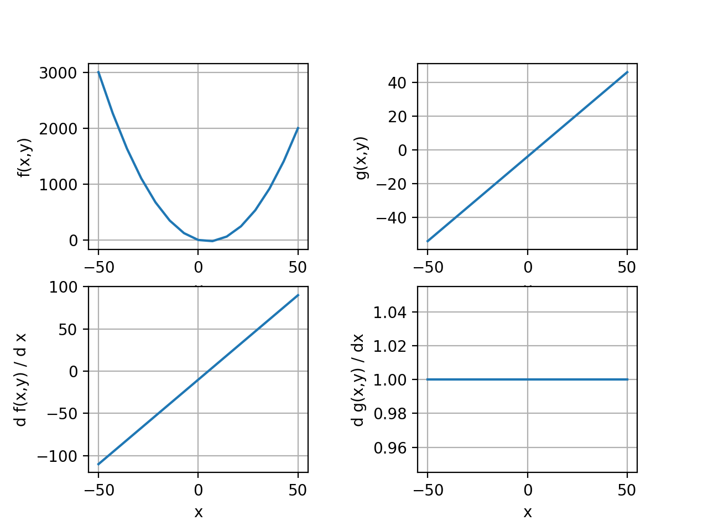

POEM ID: 073  
Title: Add ability for DOEDriver to compute and record total derivatives.  
authors: tuckerbabcock (Tucker Babcock)  
Competing POEMs:  
Related POEMs:  
Associated implementation PR: OpenMDAO/OpenMDAO#2648  

Status:

- [ ] Active
- [ ] Requesting decision
- [ ] Accepted
- [ ] Rejected
- [x] Integrated


## Motivation

When debugging a complex optimization it is essential to understand your model's behavior and to verify that its derivatives across the design space are correct. 
The `DOEDriver` is an incredibly useful tool to be able to visualize the design space, but it cannot help a user verify their derivatives across the design space. 
Instead, a user must check their model's derivatives across the design space on their own, using e.g. `check_totals`. 
This can be problematic if the user cannot use complex step to check their total derivatives, since finite differencing can be unreliable, esspecially for sufficiently complex models.

## Description

This proposal adds to the `DOEDriver` and allows it to compute and record total derivatives as it explores the design space. 
This enables easy and intuitive inspection of the model's total derivatives.

Consider this DOE of the Paraboloid problem:
```language=python
import numpy as np
import matplotlib.pyplot as plt

import openmdao.api as om
from openmdao.test_suite.components.paraboloid import Paraboloid

# build the model
prob = om.Problem()
prob.model.add_subsystem('parab', Paraboloid(), promotes_inputs=['x', 'y'])

# define the component whose output will be constrained
prob.model.add_subsystem('const', om.ExecComp('g = x + y'), promotes_inputs=['x', 'y'])

# Design variables 'x' and 'y' span components, so we need to provide a common initial
# value for them.
prob.model.set_input_defaults('x', 3.0)
prob.model.set_input_defaults('y', -4.0)

recorder = om.SqliteRecorder("paraboloid.sql")

prob.driver = om.DOEDriver(om.FullFactorialGenerator(levels=15))

prob.driver.add_recorder(recorder)
prob.driver.recording_options['record_derivatives'] = True

prob.model.add_design_var('x', lower=-50, upper=50)
# prob.model.add_design_var('y', lower=-50, upper=50)
prob.model.add_objective('parab.f_xy')

# to add the constraint to the model
prob.model.add_constraint('const.g', lower=0, upper=10.)

prob.setup()
prob.run_driver();

cr = om.CaseReader("paraboloid.sql");
cases = cr.list_cases('driver', out_stream=None)

x = []
f_xy = []
g = []
f_xy_wrt_x = []
g_wrt_x = []
for case in cases:
    outputs = cr.get_case(case).outputs
    x.append(outputs['x'])
    f_xy.append(outputs['parab.f_xy'])
    g.append(outputs['const.g'])
    derivs = cr.get_case(case).derivatives
    if derivs is not None:
        f_xy_wrt_x.append(derivs['parab.f_xy', 'x'])
        g_wrt_x.append(derivs['const.g', 'x'])
    else:
        print("None derivs!")

x = np.squeeze(x)
f_xy = np.squeeze(f_xy)
g = np.squeeze(g)
f_xy_wrt_x = np.squeeze(f_xy_wrt_x)
g_wrt_x = np.squeeze(g_wrt_x)

fig, axs = plt.subplots(2, 2)
fig.subplots_adjust(left=None, bottom=None, right=None, top=None, wspace=0.5, hspace=None)

ax1 = axs[0, 0]
ax2 = axs[0, 1]
ax3 = axs[1, 0]
ax4 = axs[1, 1]

ax1.plot(np.array(x), np.array(f_xy))
ax1.set(xlabel='x', ylabel='f(x,y)')
ax1.grid()

ax2.plot(np.array(x), np.array(g))
ax2.set(xlabel='x', ylabel='g(x,y)')
ax2.grid()

ax3.plot(np.array(x), np.array(f_xy_wrt_x))
ax3.set(xlabel='x', ylabel='d f(x,y) / d x')
ax3.grid()

ax4.plot(np.array(x), np.array(g_wrt_x))
ax4.set(xlabel='x', ylabel='d g(x,y) / dx')
ax4.grid()

plt.show()
```


The visualization of the DOE derivatives intuitively illustrates that the derivatives behave correctly across the design space.
