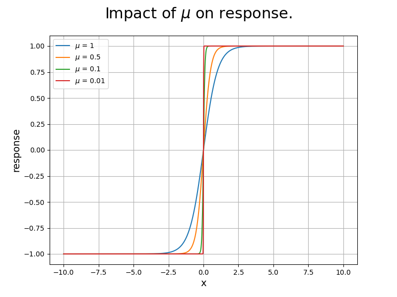
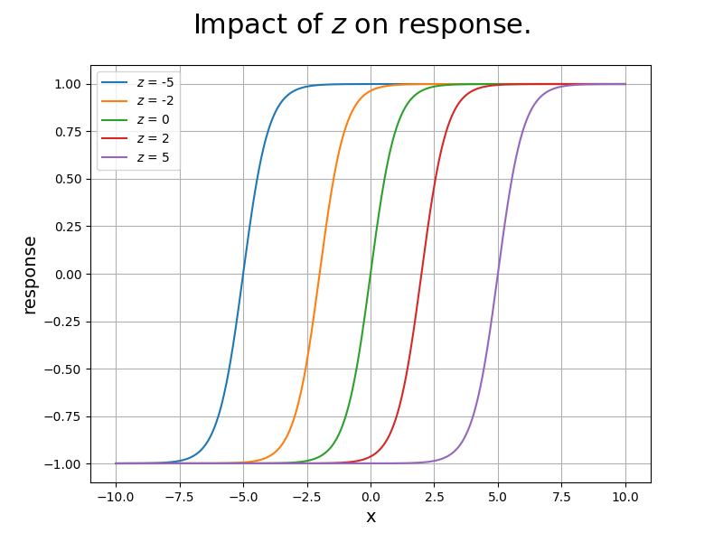
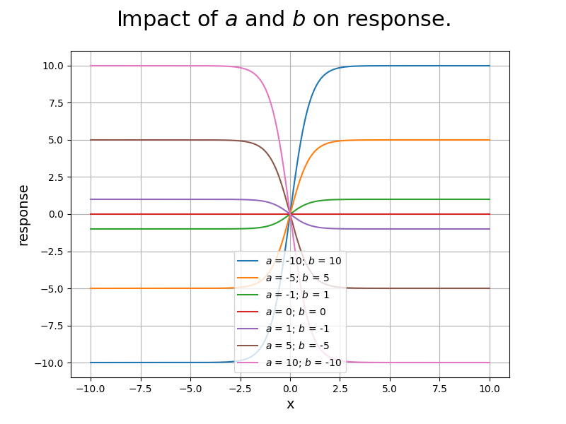

POEM ID: 080  
Title: Add an activation function to the standard component set.  
authors: robfalck (Rob Falck)  
Competing POEMs:  
Related POEMs:  
Associated implementation PR: [#TBD](https://github.com/OpenMDAO/OpenMDAO/pulls)  

Status:

- [ ] Active
- [ ] Requesting decision
- [ ] Accepted
- [x] Rejected
- [ ] Integrated


## Motivation

OpenMDAO stresses the application of derivatives to models, but does not currently include differentiable forms of if/else-like behavior.
Activation functions are widely used for differentiable selection from different values.

## Proposed Solution

This code proposes to add a new component to our standard library: TanhActivationComp. TanhActivationComp will be based on `tanh` rather than Sigmoid since it provides valid outputs across the real domain. The exponential function used in the Sigmoid/logistic function overflows with modestly large inputs or outputs.

This implementation will allow the user to modify the activation.
A reference Python implementation for the activation function based on hyerbolic tangent is given by the following code.

```
def activation(x, mu=1, z=0, a=-1, b=1):
    """
    Hyperbolic tangent with adjustable parameters.

    Parameters
    ----------
    x : float
        The nominal argument to hyperbolic tangent.
    mu : float
        The mu parameter impacts the steepness with which the transition in the value of the hyperbolic tangent occurs. The default of 1 provides the nominal behavior of the hyperbolic tangent.
    z : float
        The y-intercept of the activation function. The default of 0 provides the nominal behavior of the hyperbolic tangent.
    a : float
        The initial value of transition function. The default of -1 provides the nominal behavior of the hyperbolic tangent.
    a : float
        The final value of transition function. The default of -1 provides the nominal behavior of the hyperbolic tangent.
    """
    dy = b - a
    tanh_term = np.tanh((x - z) / mu)
    return 0.5 * dy * (1 + tanh_term) + a
```

As the value of `x` increases, this provides some smooth transition from an intial value of `a` to a final value of `b`. This transition is differentiable. Without parameters, this provides a transition from -1 to 1 with a center about `x=0`.

## TanhActivationComp

The new `TanhActivationComp` will, like `ExecComp`, allow the user to add multiple responses, each associated with its own inputs and outputs.

```
def add_response(name, units=None, input_name=None, input_units=None, mu=1, z=0, a=-1, b=1, vec_size=1, input_mu=False, input_z=False, input_a=False, input_b=False):
    """
    Add a response to the TanhActivationComp

    Parameters
    ----------
    name : str
        A valid OpenMDAO output name for the response variable.
    units : str or None
        Units of the response output.
    input_name : str or None
        A valid OpenMDAO input name for the independent variable.
        If None, the corresponding input will be f'{name}:x'.
    input_units : str or None
        Units of the input variable.
    mu : float
        The default value for the parameter mu which shapes the steepness of the response transition. The response will approach that of a step function as mu approaches zero. This parameter will also be an input named f'{name}:mu` if input_mu is True.
    z : float
        The default value for the y-intercept of the response. This parameter will also be an input named f'{name}:z' if input_z is True.
    a : float
        The default value for the response at an input value of -inf. This parameter will also be an input named f'{name}:a' if input_a is True.
    b : float
        The default value for the response at an input value of inf. This parameter will also be an input named f'{name}:b' if input_b is True.
    vec_size : int
        The vector size of the input and output.
    input_mu : bool
        If True, make mu for this response an input to the component. Otherwise, make f'{name}:mu' an option.
    input_z : bool
        If True, make z for this response an input to the component. Otherwise, make f'{name}:z' an option.
    input_a : bool
        If True, make a for this response an input to the component. Otherwise, make f'{name}:a' an option.
    input_b : bool
        If True, make b for this response an input to the component. Otherwise, make f'{name}:b' an option.
    """
```

## Other Notes

1. It should be legal to use the same input_name for two different responses, so long as they share common units and vec_size. If those differ, raise an error.

## Effects of parameters








