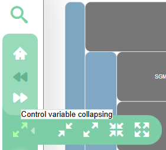
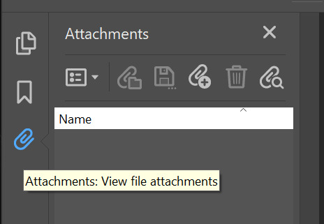
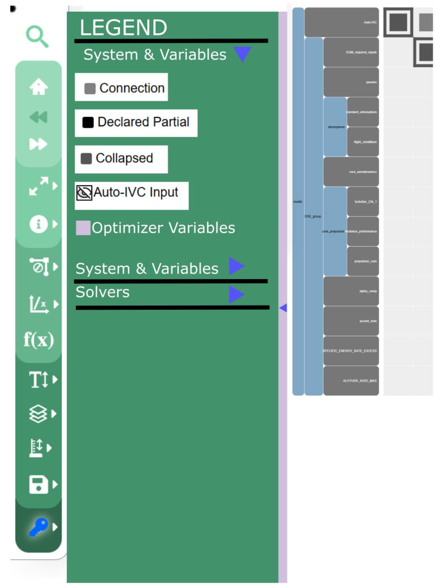
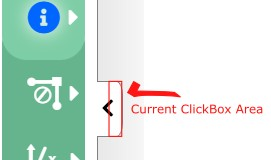
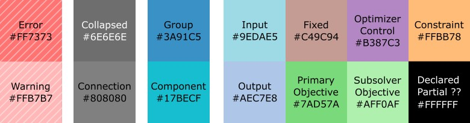
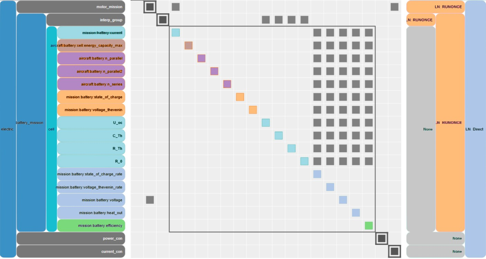
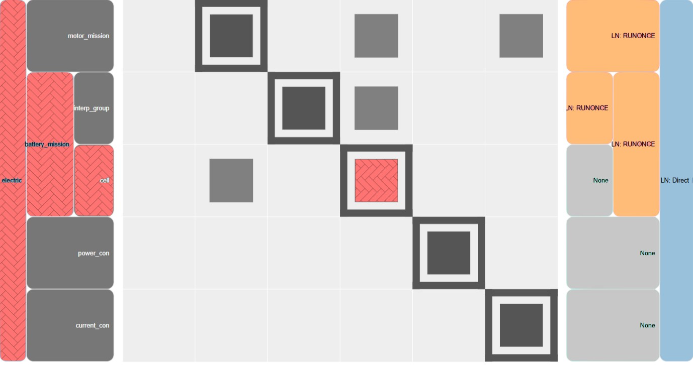
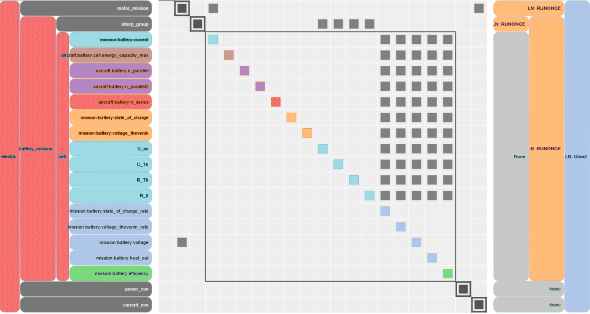
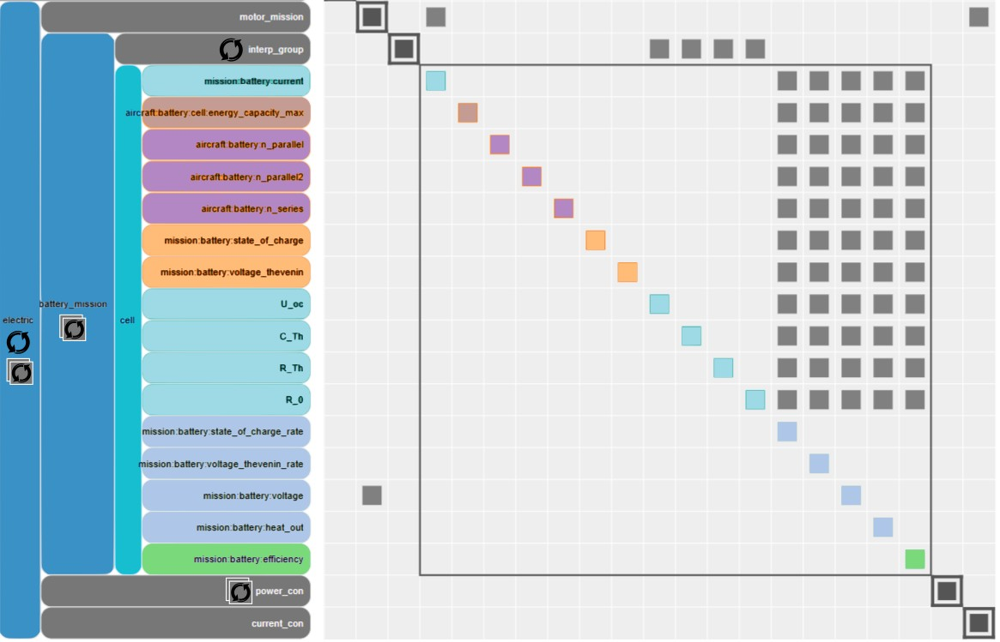

POEM ID: 103  
Title: N2 Color & Legends Revamp ++  
authors: ehariton (Eliot Aretskin-Hariton)  
Competing POEMs: None  
Related POEMs:  None  
Associated implementation PR: N/A  

Status:  

- [ ] Active  
- [ ] Requesting decision  
- [ ] Accepted  
- [ ] Rejected  
- [ ] Integrated  

## Motivation

The N2 could see some major updates to help users identify errors and increase general organization and usability. I built these recommendations based on my 8 years of using the XDSM to debug and understand OpenMDAO problems.

1. Legends for Displaying non-exclusive Items
2. Changing Default Colors of elements and hiding / showing optional items
3. The show/collapse arrow tab should have a larger click-box
4. Color Overhaul for all elements
5. Condensing solver information

## 1. Legends for Displaying non-exclusive Items Description

Current N2 behavior allows users to select different things to activate on the left-hand side that are exclusive from each other: i.e. Control Variable Collapsing select one of : Collapse all variables in current view .... to Expand all variables in entire model.

Items with multiple non-exclusive selections (i.e. Legend) should pop out in an new extra window. I propose that this extra window becomes similar to the Adobe Acrobat interface where clicking on a selection property that has multiple non-exclusive items instead expands a window on the left-hand side allowing the user a bit more detail to select which options they want to enable and disable. The selection of mimicking Adobe reader in this respect is due to the fact that many users are familiar with adobe and should therefore feel comfortable interacting with that sort of interface.

## 2. Changing Default Colors of elements and hiding / showing optional items
For some elements shown in the Legend example below, i.e. AutoIVC, the user should be able to toggle some of these elements on/off. For all elements, the user should be able to change color to best match their viewing capabilities. (Saving these preferences should be a follow-on POEM). Note that autoIVC is hidden by default (meaning the auto-IVC box does not show up on the N2). Clicking the eye icon will allow the user to "show" it.

## 3. The show/collapse arrow tab should have a larger click-box
The show/collapse arrow box click box is very small and easily covered up when other elements are open. The current click box is only a few pixels across at the moment. The click box for this should be widened for easier use.

## 4. Color Overhaul for all elements
It is hard to tell the difference between inputs (from other component, optimizer controlled, fixed, constraint) and outputs (output to a different component, objective output from subsolver, overall problem objective). To resolve these issues, we have recolorized the n2 using a modified . Note that while the N2 does not currently display errors and warnings, there is a possibility to do this in the future to help users identify visually where errors are happening in their code. Notice that we have included an "Error" and "Warning" color box that have a herring-bone pattern. That is because Errors especially are extremely important for users to catch and we need to make sure that regardless of what colors the user can see, the Errors stand out via the different texture. While these Error and Warning features are currently not available in OpenMDAO, it makes sense to allocate colors to them for their future use.

An implementation of this pallet for an example XDSM is shown below:

An example of the error color usage is shown below. First we see when the group is collapsed, it and all the groups above it are colored red+herring-bone:

Once the group is expanded we can see more details and notice that aircraft:battery:n_series is connected to a control but the inputs units mismatch. In this case, the error over-writes the typical purple indicated optimizer control.

Just as collapsing groups over-write the color of the groups inside them, I propose that errors over-write the colors of collapsed groups, inputs, and outputs.

User requests for Elements that should be listed as Warnings:
- Any AUTO_IVC / fixed input that is set to 1. Use case: "When debugging a model, looking for missing/incorrect connections is one of the first things I do. Having the N2 highlight the parameters that are being set to 1, would make this much easier" - Ben

## 5. Condensing solver information
The most useful aspect of the solver box on the right-hand side of the N2 is indicating where a solver exists when attempting to diagnose if feedback is even being processed by the system. Typical new users forget to put solvers on their groups when prevents those groups from converging. I propose that the most important information about the solvers be condensed and moved to the left-hand side of the N2.

Key information I want to make available to a user at a glance:
-Is there a solver on a group
-Is there a subsolver inside a group
-is there a sub-optimizer in this group (new feature TBD)
-is there a solver above this group

Key information that the user should be able to find while clicking the pre-existing (i) button:
- Do I have sufficient tolerances on my solvers

Less important information for average users:
- what type of solver exists on the group (solver name can be accessed via (i) already)
- there is a LN: Direct solver on every group by default

Based on the above goals, I propose using iconography as a quick way of indicating if a group has a solver on it, if there is a subsolver inside a group, and if a group contains a sub-optimization. Additionally, I propose removing the solver screen on the right-hand side of the screen, making way for useful space that the user can see.

In the example above, the two arrows rotating around each other indicate there is a solver on this group. 
The two rotating arrows inside of the double box indicate that there is a sub-solver in the group.

Concerns: How would we show solvers placed on PART of a group in this paradigm? i.e. if there was a solver covering `mtor_mission`, `battery_mission`, and `power_con` but current_con was not included in the solver? 
Perhaps this would require keeping the option to show / hide detailed solvers on the right-hand side?